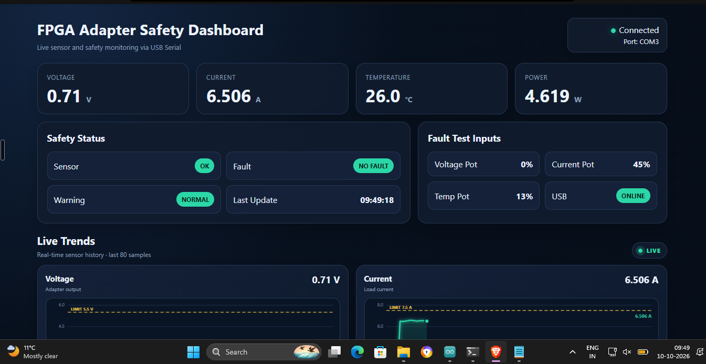
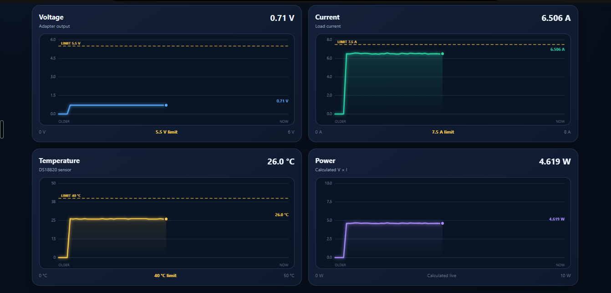

# Safe Charging Chip for Mobile Phones

### An FPGA-Assisted Smart Charging Safety System

**Team:** LogicNova  
**Competition:** VLSI Technovation 2K26  
**Achievement:** 🏆 3rd Prize  
**Host Institution:** SJC Institute of Technology, Chikkaballapura, Karnataka, India

---

## 📌 Overview

The Safe Charging Chip for Mobile Phones is a hardware-based safety monitoring prototype designed to identify potentially unsafe charging conditions by monitoring voltage, current, and temperature.

The project combines an ESP32 microcontroller, a PYNQ-Z2 FPGA platform, sensor circuitry, protective switching, alert indicators, and a dashboard for visualizing sensor data.

The goal is to demonstrate an additional layer of charging safety through sensor monitoring, threshold-based fault detection, and relay-controlled power switching.

## 📸 Dashboard Screenshots

### Live Monitoring Dashboard

The dashboard displays voltage, current, temperature, calculated power, safety status, fault-test inputs, and USB connection status.



### Real-Time Sensor Trends

Live graphs visualize voltage, current, and temperature readings against their configured safety limits.




## 🎯 Objectives

- Monitor voltage, current, and temperature.
- Identify SAFE, WARNING, and FAULT operating conditions.
- Provide visual and audible alerts for abnormal conditions.
- Demonstrate relay-based switching in response to simulated faults.
- Display sensor readings and system status.
- Explore FPGA-based digital logic for independent safety control.

## ⚙️ System Architecture

The project consists of the following components:

### 1. ESP32 Microcontroller

- Reads sensor inputs and simulated measurements.
- Processes operating conditions.
- Drives the LCD, LEDs, and buzzer.
- Communicates measurement data over UART.

### 2. PYNQ-Z2 FPGA

- Intended to implement the safety-control logic using Verilog.
- Designed to evaluate incoming data against configured thresholds.
- Intended to support fault detection and relay control.

**Implementation note:** The FPGA implementation was not fully functional during the project demonstration. Complete ESP32–FPGA integration and end-to-end validation remain future work.

### 3. Sensors and Input Simulation

The prototype uses potentiometers to simulate changes in voltage, current, and temperature inputs, allowing different operating conditions to be demonstrated without deliberately stressing a real battery.

The design also incorporates voltage, current, and temperature sensing components.

### 4. Protection and Alert Circuitry

- LEDs indicate operating status.
- A buzzer provides audible alerts.
- A relay demonstrates switching of the controlled power path.
- An LCD displays readings and system information.

### 5. Dashboard and Communication

A Python-based serial communication bridge reads ESP32 output and forwards sensor data through WebSocket for visualization on a dashboard.

## ✨ Key Features

- Voltage, current, and temperature input monitoring.
- SAFE, WARNING, and FAULT state demonstration.
- Potentiometer-based fault simulation.
- LED and buzzer alerts.
- Relay-based switching demonstration.
- LCD-based status display.
- Serial communication between the ESP32 and the monitoring software.
- Dashboard visualization of sensor readings.

## 🔄 Working Principle

1. **Input generation:** Sensors or potentiometers provide the input values representing charging conditions.
2. **Data acquisition:** The ESP32 reads the inputs and processes the measurements.
3. **Condition evaluation:** The ESP32-based demonstration evaluates simulated conditions and responds according to the configured operating states.
4. **Status indication:** LEDs, the buzzer, and LCD communicate the detected condition.
5. **Protective switching:** The relay demonstrates switching in response to the simulated fault condition.
6. **Dashboard visualization:** The Python bridge forwards serial readings to the dashboard for display.
7. **FPGA development:** A Verilog-based safety-control design was developed for the PYNQ-Z2, but its complete integration was not successfully validated.

## 🟢 Operating States

| State | Demonstrated behavior |
|---|---|
| SAFE | Normal status indication and relay operation |
| WARNING | Warning indication for an elevated simulated input |
| FAULT | Fault indication, buzzer alert, and relay switching |

Potentiometers were used to simulate abnormal inputs during the prototype demonstration.

## 🧰 Technologies Used

| Category | Technologies |
|---|---|
| FPGA platform | PYNQ-Z2 |
| Hardware description language | Verilog |
| Microcontroller | ESP32 |
| Firmware development | C/C++, Arduino IDE |
| Communication | UART, WebSocket |
| Communication bridge | Python |
| Dashboard | HTML, CSS, JavaScript |
| Hardware | Sensors, LCD, LEDs, buzzer, relay |

## 📁 Repository Structure

```text
Safe-Charging-Chip-for-Mobile-Phones/
├── README.md
├── esp32/
│   └── ESP32 firmware
├── verilog/
│   └── FPGA source code
├── python_bridge/
│   └── Python serial/WebSocket bridge
├── dashboard/
│   └── Dashboard source (if available)
├── hardware/
│   └── Circuit diagrams and connection guides
├── images/
│   └── Prototype and award photos
└── docs/
    ├── Project presentation
    ├── Project report
    └── Project synopsis
```

## 🧪 Implementation Status

### Implemented and Demonstrated

- ESP32-based prototype with potentiometer-based input simulation.
- SAFE, WARNING, and FAULT behavior in the demonstration.
- LED and buzzer responses.
- Relay-based switching demonstration.
- LCD-based readings and status display.

### Software and Dashboard

A Python communication bridge was developed to forward serial readings to a dashboard. The dashboard and communication workflow can be documented separately from the FPGA implementation.

### FPGA Implementation

Verilog safety-control logic was developed for the PYNQ-Z2 FPGA. However, the FPGA code did not function completely, and full end-to-end integration with the ESP32 was not achieved.

The FPGA-based safety path therefore requires further debugging, integration, and validation.

## 🏆 Achievement

Secured **3rd Prize** for the *Safe Charging Chip for Mobile Phones* project at **VLSI Technovation 2K26**, an intercollegiate technical competition hosted by **SJC Institute of Technology, Chikkaballapura, Karnataka, India**.

The project provided practical experience in embedded systems, FPGA-based digital design, sensor interfacing, hardware integration, safety logic, and real-time data visualization.

## 👥 Team LogicNova

This was a collaborative team project, developed and presented by:

- **Prisha V K**
- **Adithya S P**
- **Prerana Hegde**
- **Dashami C**

We worked together on the project development, hardware experimentation, system exploration and presentation.


## 🚀 Future Improvements

- Debug and validate the Verilog implementation.
- Complete UART communication and ESP32–FPGA integration.
- Verify the FPGA safety logic through simulation and hardware testing.
- Calibrate voltage and current sensors.
- Improve fault handling and system reliability.
- Validate protective switching under controlled, low-voltage conditions.
- Explore a compact PCB implementation and future CPLD or ASIC deployment.

## ⚠️ Safety Disclaimer

This project is an educational prototype and is not a certified consumer charging safety device. The prototype demonstration does not establish protection against all charging faults, battery failures, or fire hazards.

Testing should be limited to appropriate low-voltage DC sources and dummy loads. Do not connect an unvalidated prototype directly to mains electricity or a real phone battery.

## 👩‍💻 Author

**Prisha**  
Electronics and Communication Engineering Student

